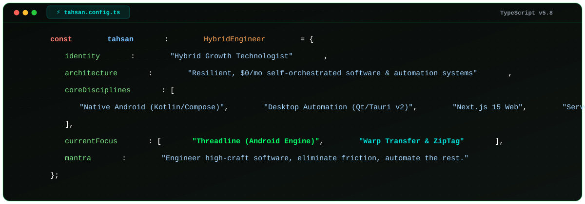
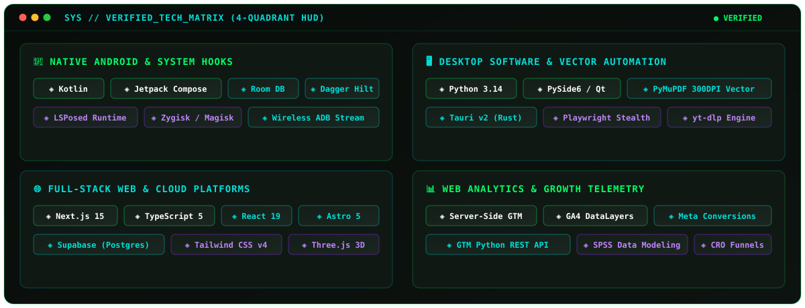
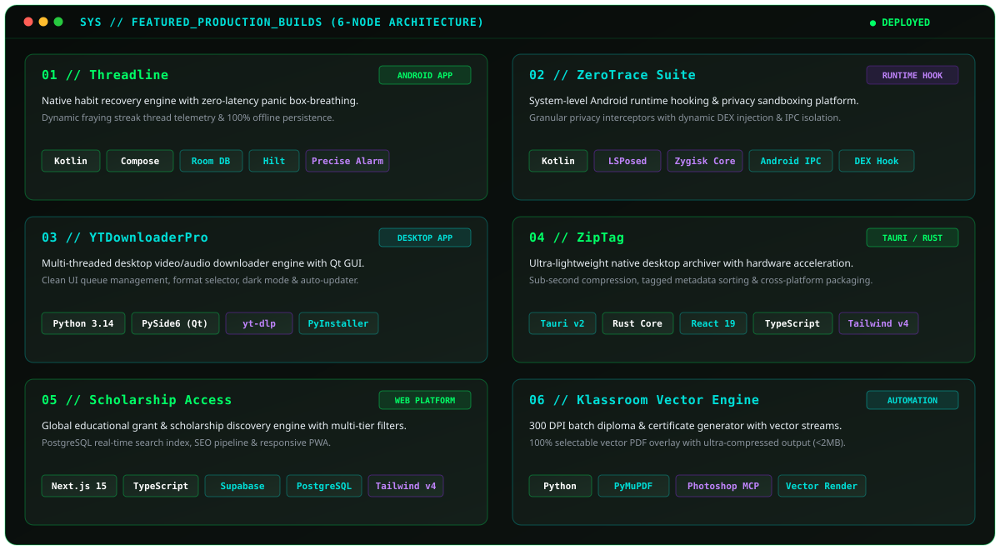

  <!-- TAHSAN.OS Vector Pixel Wordmark & CRT Terminal Banner -->
  

    

  <!-- Status Badges -->
  

    
    &nbsp;
    
    &nbsp;
    
  

---

### 💻 `01 // DEVELOPER_OBJECT`

  

---

### 🛠️ `02 // VERIFIED_TECH_MATRIX`

  

---

### 🚀 `03 // FEATURED_PRODUCTION_BUILDS`

  

---

### 📈 `04 // GITHUB_TELEMETRY`

  
  &nbsp;
  

---

### 📡 `05 // SESSION_ENDPOINTS`

  
  &nbsp;&nbsp;
  
  &nbsp;&nbsp;
  

    

  <code>[SESSION_TERMINATED] >> Connection to TAHSAN.OS closed cleanly.</code>

