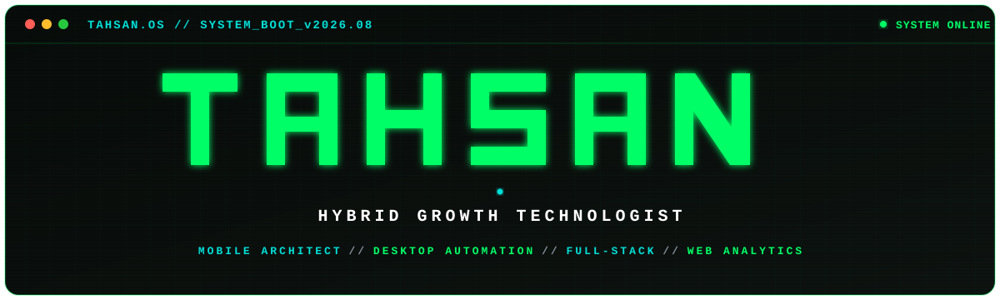

<div align="center">

  <!-- TAHSAN.OS Vector Pixel Wordmark & CRT Terminal Banner -->
  <a href="https://github.com/tahsanahmmed25">
    
  </a>

  <br/><br/>

  <!-- Status Badges -->
  <p align="center">
    <a href="https://github.com/tahsanahmmed25"></a>
    &nbsp;
    <a href="https://github.com/tahsanahmmed25"></a>
    &nbsp;
    <a href="https://github.com/tahsanahmmed25"></a>
  </p>

</div>

---

### 💻 `01 // DEVELOPER_OBJECT`

```typescript
// ⚡ INITIALIZING: tahsan.config.ts
interface GrowthTechnologist {
  name: "Tahsan Ahmmed";
  identity: "Hybrid Growth Technologist";
  domains: [
    "Native Android Engineering (Kotlin / Jetpack Compose / LSPosed)",
    "Desktop & PDF Vector Automation (Python Qt / PyMuPDF 300 DPI)",
    "Full-Stack Web Architectures (Next.js 15 / Supabase / TypeScript)",
    "Server-Side Analytics & Tagging (GTM REST API / GA4 DataLayers / Meta CAPI)",
    "Systemless Device Modding (Magisk / Zygisk / Wireless ADB Streaming)"
  ];
  architecture: "Resilient, $0/mo self-orchestrated software & automation systems";
  currentFocus: "Scaling Threadline & ZeroTrace Suite";
  mantra: "Engineer high-craft software, eliminate friction, automate the rest.";
}
```

---

### 🛠️ `02 // VERIFIED_TECH_MATRIX`

<div align="center">

| Domain | Systems & Frameworks |
| :--- | :--- |
| **📱 Native Android & Modding** |       |
| **🖥️ Desktop & Document Automation** |    -00DFD8?style=flat-square&logo=tauri&logoColor=black&labelColor=0D1117)   |
| **🌐 Full-Stack Web & Cloud** |       |
| **📊 Web Analytics & Growth** |      |

</div>

---

### 🚀 `03 // FEATURED_PRODUCTION_BUILDS`

#### 📱 [Threadline](https://github.com/tahsanahmmed25) — Native Android Habit Recovery Engine
> `Kotlin` • `Jetpack Compose` • `Dagger Hilt` • `Room DB` • `Alarms`  
> * **Zero-Latency Panic Button:** 100% offline box-breathing animation for immediate impulse regulation.
> * **Dynamic Fraying Telemetry:** Visual streak thread that dynamically updates and persists without battery drain.

#### 🛡️ [ZeroTrace Suite](https://github.com/tahsanahmmed25) — System Runtime & Privacy Hooking
> `Kotlin` • `Android IPC` • `LSPosed Hooks` • `Privacy Interceptors`  
> * **Modular Hooking Architecture:** Granular interceptors (`WA-RuntimeKit`, `Messenger RuntimeKit`) for zero-trace sandboxing.

#### 🎬 [YTDownloaderPro](https://github.com/tahsanahmmed25/YTDownloaderPro) — Desktop Video Downloader
> `Python 3.14` • `PySide6 (Qt GUI)` • `yt-dlp Core` • `PyInstaller`  
> * **Multi-threaded Media Engine:** Fast video/audio streaming, format selector, and persistent download queue.

#### 📦 [ZipTag](https://github.com/tahsanahmmed25/ZipTag) — High-Speed Desktop Archiver
> `Tauri v2` • `Rust Core` • `React 19` • `TypeScript` • `Tailwind CSS`  
> * **Native File Compression:** Ultra-lightweight, hardware-accelerated archiver with auto-updater subsystem.

#### 🌐 [Scholarship Access](https://github.com/tahsanahmmed25) — Global Grant Discovery Portal
> `Next.js 15` • `TypeScript` • `Supabase PostgreSQL` • `Tailwind CSS v4`  
> * **High-Speed Educational Search:** Multi-tier filtering, real-time database indexing, and responsive PWA layout.

#### 🖥️ [Klassroom Vector Engine](https://github.com/tahsanahmmed25) — 300 DPI Batch Certificate Pipeline
> `Python` • `PyMuPDF` • `Photoshop MCP` • `Vector Stream Overlay`  
> * **Lightweight Vector PDFs:** High-res 300 DPI raster artwork merged with 100% selectable live vector text streams (<2MB).

---

### 📈 `04 // GITHUB_TELEMETRY`

<div align="center">

  
  &nbsp;
  

</div>

---

### 📡 `05 // SESSION_ENDPOINTS`

<div align="center">

  [](https://linkedin.com/in/tahsanahmmed24)
  &nbsp;&nbsp;
  [](https://wa.me/8801303307107)
  &nbsp;&nbsp;
  [](mailto:ztahsan21@gmail.com)

  <br/><br/>

  <sub><code>[SESSION_TERMINATED] >> Connection to TAHSAN.OS closed cleanly.</code></sub>

</div>
